# Introduction
The purpose of this repository is to accompanying my Master's thesis about quasi-Newton methods. `quasi-Newton.ipynb` implements some of the discussed algorithm and can be used to reproduce* the plots shown in Chapter 5.

*The notebook was run in a standard Google Colab instance with fixed seed (`SEED = 20260916`), so the calculation can be exactly reproduced. Different hardware will (probably) not reproduce the exact performance numbers, but will show the same general trends.

# The minimal surface problem
We test our implementations on the *minimal surface problem* described by Ulbrich and Ulbrich (2012). Following their description, we are given an open domain $\Omega \subset \mathbb{R}^2$  as well as boundary conditions $r: \Gamma \to \mathbb{R}$ on $\Gamma = \partial \Omega \subset \mathbb{R}^2$ and want to find the function $q: \bar{\Omega} \to \mathbb{R}$ minimizing the surface area subject to $q|_{\Gamma} = r$, i.e. solve
```math
		\min\limits_{q}\quad \int_\Omega \sqrt{1 + |\nabla q(x, y)|^2}\, \mathrm{d}(x, y) \quad \text{subject to } q \equiv r \text{ on } \Gamma.
```

One can approximate the solution by introducing discretizations $\Omega_T := \bigcup_{i = 1}^{m_\ell} T_i$ (at different levels $\ell$ of refinement) of the domain $\bar{\Omega}$ using $m_\ell$ triangles $T_1, \ldots, T_{m_\ell}$ with $n$ (shared) interior nodes and $l$ (shared) boundary nodes. More specifically, the surface area of $q$ can then be approximated by summing the surface area of a piecewise linear, continuous function $q_T: \Omega_T \to \mathbb{R}$. Since $q_T$ is piecewise linear on each triangle, both $q_T$ and its surface area is uniquely identified by the values it takes on the $n + l$ nodes. Since the boundary constraints force the values of $q_T$ at the boundary nodes, we can express the surface area $A: \mathbb{R}^n \to \mathbb{R}$ as a function of the heights it takes on the interior nodes. Therefore, we try to solve the (unconstrained) optimization problem
```math
		\min\limits_{\tilde{y} \in \mathbb{R}^{n}}\quad A(\tilde{y}) = \sum_{i = 1}^{m_\ell} A_i(\tilde{y}).
```

The implementation `quasi-Newton.ipnyb` offers the possibility to plot different $\tilde{y} \in \mathbb{R}^{n}$. Choosing $\Omega = (-1, 1)^2$, $r: \Gamma  \to \mathbb{R}, (x_1, x_2) \mapsto \frac{1}{2} - |x_2|$ and $n = 481$, we generate visualizations for different quasi-Newton iterates, namely a handcrafted and boundary-compatible initial guess (with and without sinusoidal noise) and $\tilde{y}$ at iteration 2 and 18.

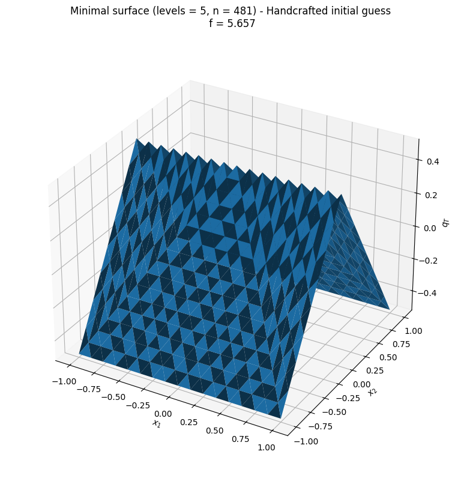 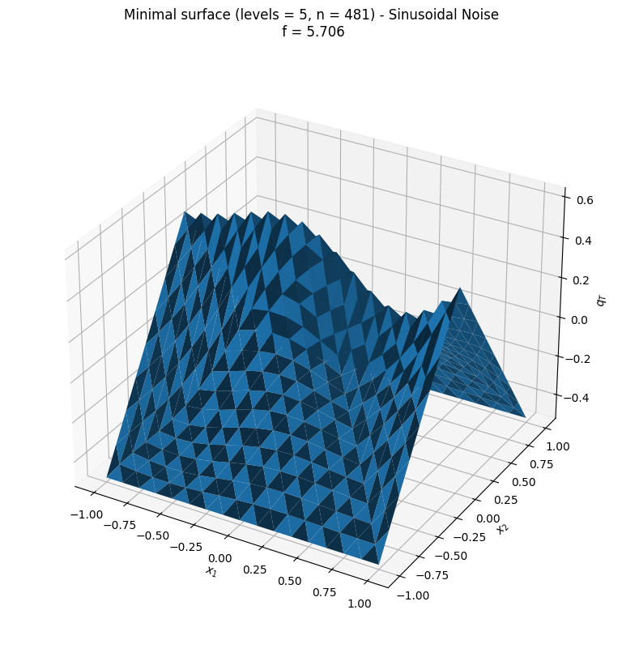
 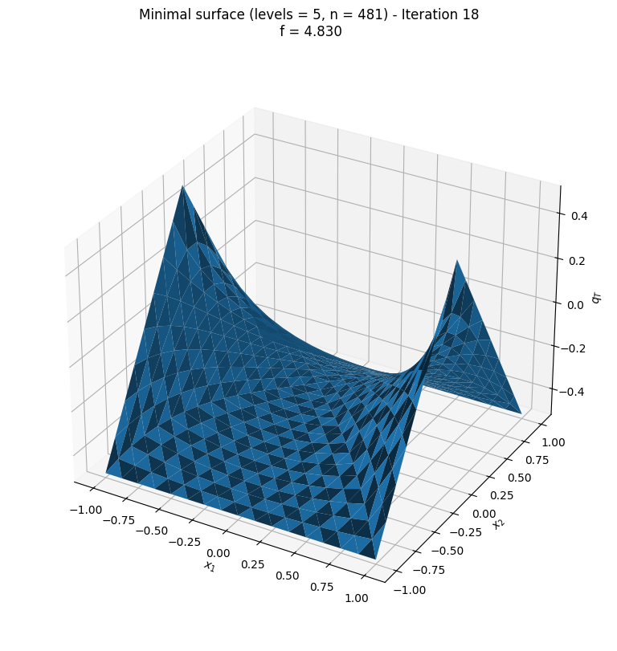

# Efficiently evaluating quasi-Newton methods
The interpretation of Limited Memory (inverse) BFGS by Gilbert and Nocedal (1993) as a combination of the efficient calculation of $f_{k + 1}(d) = \frac{1}{2}\langle d, B_{k + 1} d$, where B_{k + 1} is the current approximation to the **inverse** Hessian and $d \in (\mathbb{R}^n)^*$ an arbitrary dual vector, with reverse-mode Automatic Differentiation to calculate $B_{k + 1}d$, can be extended to other quasi-Newton methods. 

The sum form of an inverse method (as an example), is given by
```math
		B_{k + 1} = B_{0} + \sum_{i = 0}^{k} V(B_i, s_i, y_i),
```
and the semi-product form by
```math
		B_{k + 1} = Q_k^* B_{k} Q_k + S_k = Q_k^* \ldots Q_0 B_0 Q_0 \ldots Q_k + \sum_{i = 0}^{k} Q_k^*\ldots Q_{i + 1} S_i Q_{i + 1} \ldots Q_k,
```
where $Q_0, \ldots, Q_k \in \mathcal{L}((\dualspace{\mathbb{R}^n)^*, (\mathbb{R}^n)^*)$ are projection operators and $S_0, \ldots, S_k \in \mathcal{L}((\mathbb{R}^n)^*, \mathbb{R}^n)$ are of rank at most $2$. More specifically, for inverse Broyden we have $S_i = \rho_i s_i \otimes s_i + \lambda \langle y_i, B_i y_i \rangle w_i \otimes w_i$ and for all other inverse methods $S_i = \rho_i s_i \otimes s_i$.

Evaluations of the sum form lead, using inverse DFP as an example, to recursion formulas such as
```math
f_{k + 1}(d) = \frac{1}{2} \langle d, B_{k + 1}d \rangle = \frac{1}{2} \langle d, B_0 d \rangle + \frac{1}{2}\sum_{i = 0}^k \left(-\frac{\langle d, p_i \rangle^2}{\langle y_i, p_i \rangle} + \rho_i \langle d, s_i \rangle^2\right),
```
where $p_0 = B_0 y_0, \ldots, p_k = B_k y_k$ are auxiliary (precomputed) quantities. Evaluations of the semi-product form, using inverse DFP again, we get
```math
    f_{k + 1}(d) = \frac{1}{2} \langle d, B_{k + 1} d \rangle = \frac{1}{2} \langle q_0, B_0 q_0 \rangle + \sum_{i = 0}^{k} \frac{\rho_i}{2} \langle q_{i + 1}, s_i \rangle^2,
```
where $q_{k + 1} = d, q_{i} := S_i q_{i + 1}$ with $S_i = I - \frac{y_i \otimes p_i}{\langle y_i, p_i \rangle}$.

One can now calculate $f$ (and for the semi-product form $q_{k + 1}, \ldots, q_0$) iteratively in the forward pass, and using reverse-mode Automatic Differentiation $B_{k + 1} d$ in the reverse pass. Assuming that the quantities $p_0, \ldots, p_k$ have been precomputed and that evaluating $B_0 d$ costs $T(n)$ all these algorithms have time complexity $\mathcal{O}(T(n) + kn)$. 

For full-memory methods, $p_k = B_k y_k$ can be calculated simply by using any algorithm designed for calculating $B_k d$ for arbitrary $d \in (\mathbb{R}^n)^*$ and setting $d = y_k$. Thus, computing $p_k$ has the same $\mathcal{O}(T(n) + kn)$ effort. If the results $p_0, \ldots, p_{k - 1}$ from previous iterations are stored, then the whole algorithm, including the calculation of any external auxiliary quantity, still runs in $\mathcal{O}(T(n) + kn)$. 

The following plots show the relative difference (in the $|| \cdot ||_\infty$-norm) of our full-memory quasi-Newton implementations to the reference matrix-update, where the red lines denote machine precision.

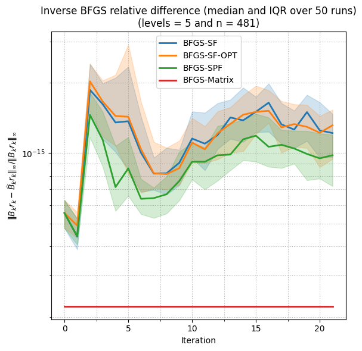 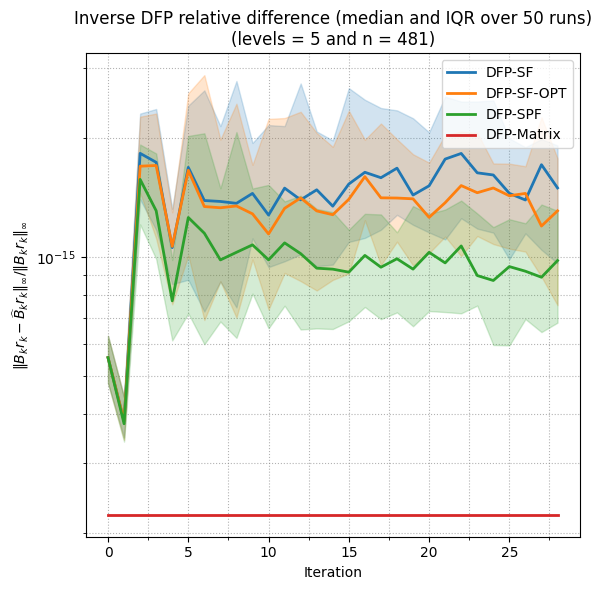 
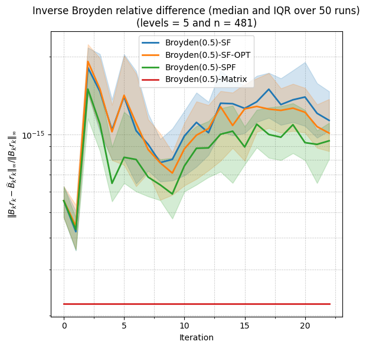 

When analyzing their performance, we can clearly see the linear dependence of $\mathcal{O}(T(n) + kn)$ on  $k$. Interestingly, even in smaller dimension, where the full matrix update can be constructed in reasonable time, the matrix-free algorithms usually reach the stopping criterion before the iteration dependence becomes too costly.

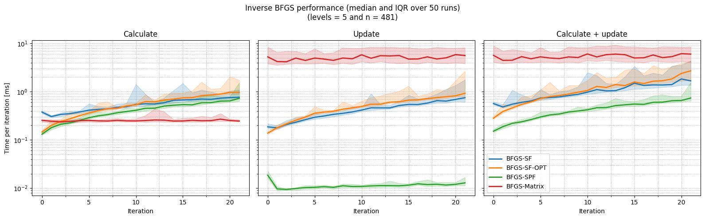 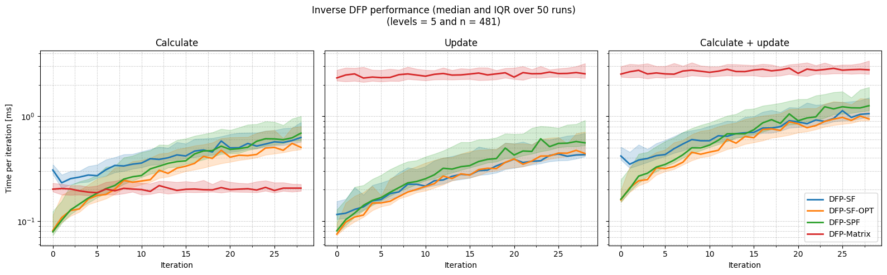 
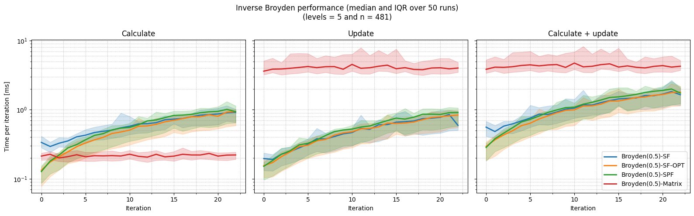 

One can, as we did, turn the matrix-free algorithms into Limited Memory quasi-Newton methods by restricted the number of included curvature pairs to the $m$ most recent pairs. Since the underlying quasi-Newton operators may now depend on the current iteration, the quantities $p_0, \ldots, p_k$ might become stale. In situations, where Limited Memory methods are combined with a fixed initial operator $B_0^{(k + 1)} = B_0$, there exists an efficient algorithm ($\mathcal{O}(T(n) + mn)$) for DFP and BFGS to update $p^{(k)}_{k - m}, \ldots, p^{(k)}_{k - 1}$ rather than compute $p^{(k + 1)}_{k - m + 1}, \ldots, p^{(k + 1)}_{k}$. In other case, one can compute $p^{(k + 1)}_{k}, \ldots, p^{(k + 1)}_{k}$ at a cost of $\mathcal{O}(mT(n) + m^2n)$.

We also compared the different performance classes when updating the auxiliary quantities in Limited Memory methods in some plots:

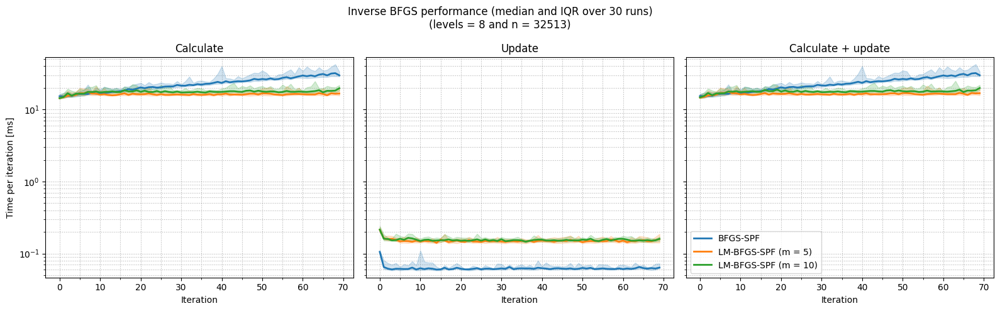 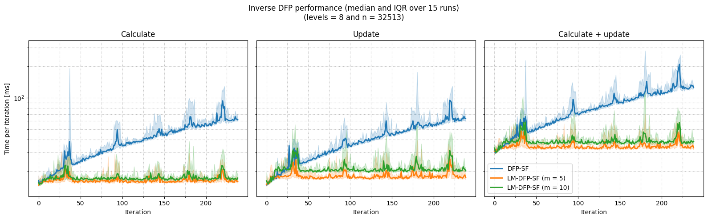 
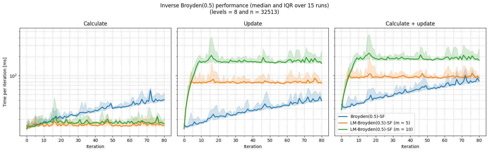 

One could also directly compare the naive algorithm for the calculation of auxiliary quantities with the new one:

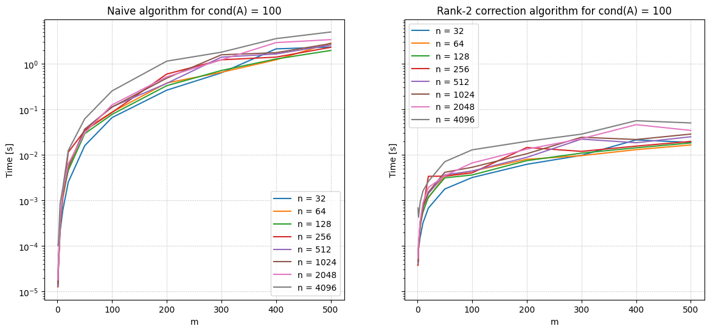 
	


